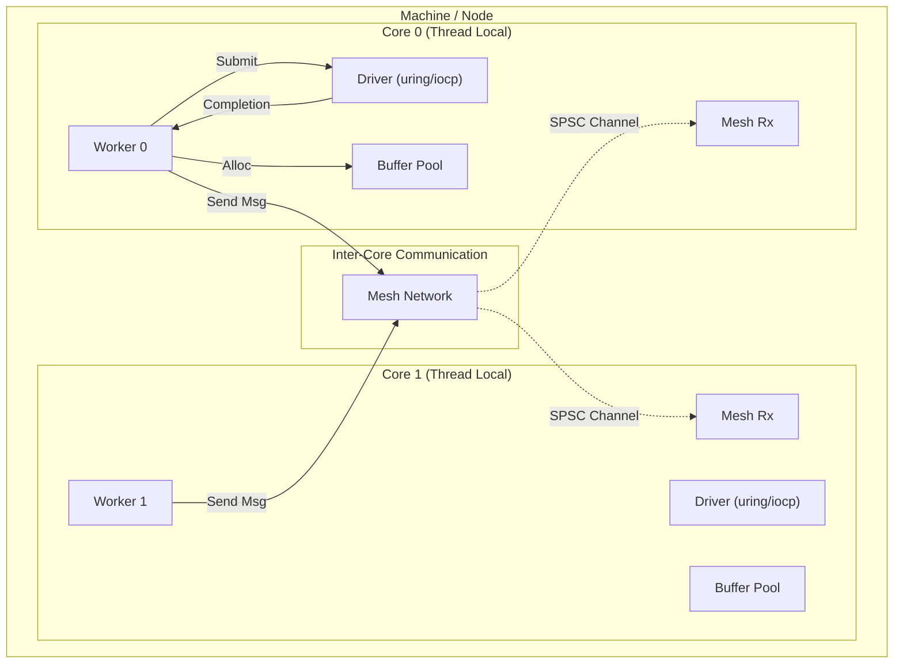
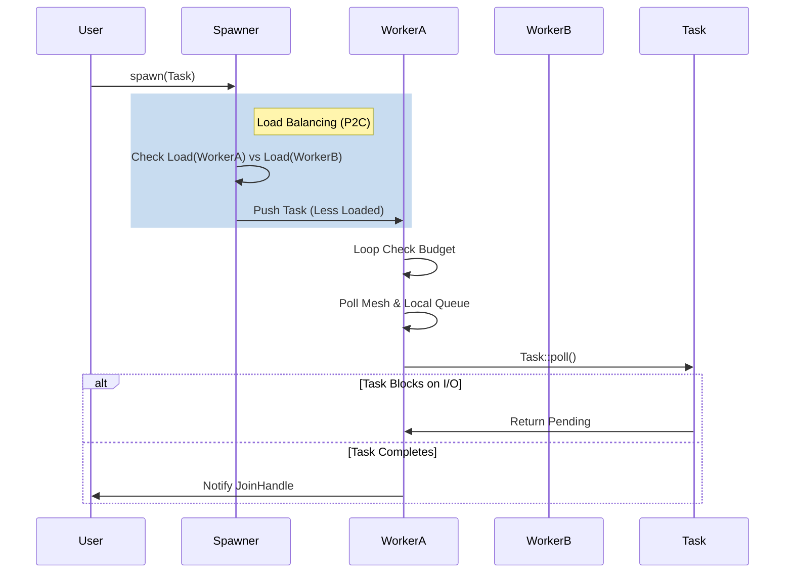
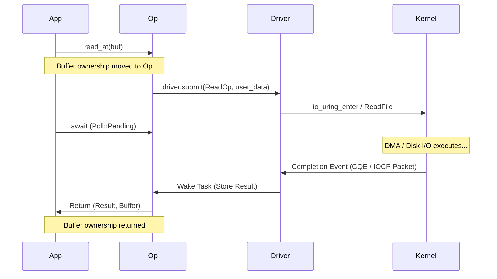
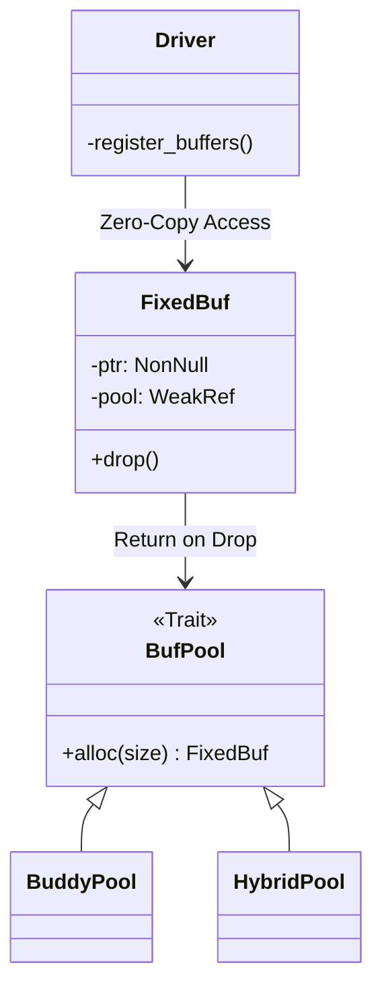

# Veloq 架构设计文档 (Architecture Design)

本文档提供了 Veloq 运行时的高层架构概览，阐述了其核心设计理念、组件交互流程以及针对不同操作系统的适配策略。

## 1. 核心理念 (Core Philosophy)

Veloq 的设计深受 **Seastar** 和 **Glommio** 的影响，旨在为 Rust 生态带来极致的 I/O 性能。核心原则如下：

### 1.1 Thread-per-Core & Shared-Nothing
传统的线程池模型（如 Tokio 的默认多线程运行时）虽然通用性强，但在极高吞吐场景下，跨核同步（Mutex/RwLock）、原子操作（Atomic CAS）以及 CPU 缓存抖动（Cache Bouncing）会成为显著瓶颈。

Veloq 采用 **Thread-per-Core** 模型：
- 每个 CPU 核心绑定一个独立的 Worker 线程。
- 每个 Worker 拥有独立的任务队列、I/O 驱动 (Driver) 和 缓冲区池 (Buffer Pool)。
- 线程间**不共享任何可变状态**。唯一的交互方式是通过 **Mesh Network** 进行消息传递。

### 1.2 Proactor I/O 模型
不同于基于 `epoll` 的 Reactor 模型（就绪通知），Veloq 拥抱现代操作系统的 **Proactor** 模型（完成通知）：
- **Linux**: io_uring
- **Windows**: IOCP

这意味着 I/O 缓冲区的所有权必须在提交时移交给内核，从而实现真正的 **Zero-Copy** 和内核级批量处理。

## 2. 系统架构 (System Architecture)

下图展示了 Veloq 运行时的顶层视图：

### 2.1 组件层级

Veloq 的代码组织结构如下：

1.  **Interface Layer (`src/net/`, `src/fs/`)**: 
    - 提供类似 `std` 的高级 API (`TcpStream`, `File`)。
    - 负责将用户请求封装为 `Op` 并提交给 Runtime。

2.  **Runtime Layer (`src/runtime/`)**:
    - **Executor**: 负责 Task 的调度与执行。
    - **Context**: 管理线程局部状态 (TLS)，确保 I/O 操作都能找到对应的 Driver。
    - **Mesh**: 实现跨线程的高效通信（SPSC Ring Buffer）。

3.  **I/O Layer (`src/io/`)**:
    - **Driver**: 屏蔽 OS 差异的 Proactor 抽象。
    - **Buffer**: 基于 Slab 或 Buddy System 的内存管理，保证物理地址稳定。

## 3. 关键流程 (Key Flows)

### 3.1 任务调度与执行

Veloq 采用混合调度策略，结合了 **Work Stealing** 和 **Power of Two Choices (P2C)**。

### 3.2 异步 I/O 生命周期

以 `File::read_at` 为例，展示从用户调用到数据返回的全过程：

### 3.3 跨平台适配

Veloq 通过 `Driver` Trait 和 `PlatformOp` 实现跨平台。

| 特性 | Linux (io_uring) | Windows (IOCP) | 抽象策略 |
| :--- | :--- | :--- | :--- |
| **模型** | Submission/Completion Rings | Completion Queue | Driver::submit / Driver::process_completions |
| **内存要求** | 推荐注册缓冲区 (Fixed Buf) | 需要重叠结构 (OVERLAPPED) 稳定 | StableSlab 分配器 |
| **Socket创建** | `socket()` syscall | `WSASocket` | OpLifecycle::pre_alloc |
| **Accept** | 返回新 fd | 需预先创建 Socket (`AcceptEx`) | OpLifecycle::into_output |
| **阻塞操作** | 完美异步 (大部分) | 部分文件操作需线程池 | Driver 内部集成 ThreadPool |

## 4. 内存管理 (Memory Management)

Veloq 强制使用 **FixedBuf** 进行 I/O，这与常规 Rust `AsyncRead` (`&mut [u8]`) 不同。

- **User Space**: 用户从 `BufPool` 申请 `FixedBuf`。
- **Kernel Space**: 
    - **Linux**: 缓冲区可预注册 (`IORING_REGISTER_BUFFERS`)，内核只通过索引访问，极大减少开销。
    - **Windows**: 缓冲区地址必须锁定。
- **Lifecycle**: `FixedBuf` 实现了 RAII，Drop 时自动归还 Pool。

## 5. 总结

Veloq 是一个为**极致性能**而生的运行时。它牺牲了一定的易用性（如强制的缓冲区管理、非标准的 I/O Trait），换取了对硬件资源的最大化利用。它通过严格的 Thread-per-Core 模型和精细的 Proactor 抽象，为构建下一代高性能数据库、存储系统和网络服务提供了坚实的基础。
