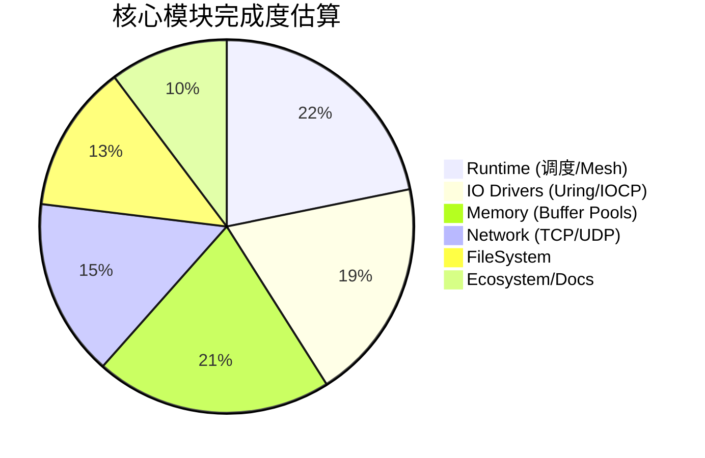

# 项目当前进展 (Project Status)

本文档汇总了 Veloq 项目各模块的开发状态、已完成特性以及待办事项列表。

**最后更新时间**: 2026-01-07
**总体状态**: 🚧 **Alpha 阶段** (核心架构已定型，API 尚未冻结)

## 仪表盘 (Dashboard)

---

## 1. 核心运行时 (Runtime Core)
> **状态**: ✅ **大部分完成 (Mostly Completed)**

建立了基于 **Thread-per-Core** 的模型，实现了高效的混合调度算法。

- [x] **Local Executor**: 主循环、Budget 机制、Park/Unpark 状态机。
- [x] **Task System**: 手动 VTable 实现的轻量级 Task，支持 `Waker` 唤醒。
- [x] **Mesh Network**: 基于 RingBuffer 的 Worker 间无锁通信 (SPSC)。
- [x] **调度算法**:
    - [x] **P2C (Power of Two Choices)**: 发送端负载均衡。
    - [x] **Work Stealing**: 接收端负载均衡。
- [ ] **待办 (TODO)**:
    - [ ] **Blocking Pool**: 缺乏处理 CPU 密集型或同步系统调用的专用线程池。
    - [ ] **协作式抢占**: 防止死循环任务卡死 Worker。
    - [ ] **Task Debugging**: 增加任务追踪和调试视图。

## 2. I/O 驱动层 (IO Drivers)
> **状态**: ⚠️ **完善中 (Stabilizing)**

统一了 Linux (io_uring) 和 Windows (IOCP) 的 Proactor 抽象。

### 2.1 通用抽象
- [x] **Driver Trait**: 定义了 `submit`, `poll_op` 等统一接口。
- [x] **StableSlab**: 实现了地址稳定的 Slab 分配器，用于存储 In-Flight Operations。
- [x] **OpRegistry**: 类型擦除的操作注册表。

### 2.2 Linux (io_uring)
- [x] **基础支持**: 提交队列 (SQ) 和完成队列 (CQ) 的管理。
- [x] **特性开关**: 支持 `Single Issuer` 和 `Defer Taskrun` 等新内核特性。
- [x] **Backlog**: 简单的链表 Backlog 处理 SQ 满的情况。
- [ ] **待办 (TODO)**:
    - [ ] **Zero Copy**: 集成 `IORING_OP_SEND_ZC`。
    - [ ] **Multishot**: 利用 `IORING_RECV_MULTISHOT` 优化吞吐。
    - [ ] **Fixed Files**: 支持文件描述符注册以减少内核开销。

### 2.3 Windows (IOCP)
- [x] **基础支持**: 基于 `GetQueuedCompletionStatus` 的事件循环。
- [x] **扩展函数**: 动态加载 `ConnectEx`, `AcceptEx`。
- [x] **阻塞回退**: 对于 `Open`/`Close` 等同步 API 实现了线程池分流。
- [ ] **待办 (TODO)**:
    - [ ] **Registered I/O (RIO)**: 探索 RIO 以降低网络 I/O 延迟。
    - [ ] **SyncFileRange**: 寻找比 `FlushFileBuffers` 更细粒度的刷盘方案。

## 3. 内存管理 (Memory)
> **状态**: ✅ **可用 (Functional)**

- [x] **FixedBuf**: 实现了拥有权的缓冲区抽象，适配 Proactor 模型。
- [x] **分配器**:
    - [x] **BuddyPool**: 通用的伙伴系统分配器。
    - [x] **HybridPool**: 针对网络包优化的 Slab + Global 混合分配器。
- [x] **对齐**: 强制 4KB 对齐，满足 Direct I/O 需求。
- [ ] **待办 (TODO)**:
    - [ ] **动态扩容**: 支持 Arena 的动态增长。
    - [ ] **跨线程归还**: 支持 `FixedBuf` 在不同线程间流转并安全释放。
    - [ ] **Huge Page**: 支持大页分配。

## 4. 上层 API (Net & FS)
> **状态**: 🛠️ **基础功能 (Basic)**

### 4.1 网络 (Net)
- [x] **TCP**: `TcpListener`, `TcpStream` (Connect, Read, Write)。
- [x] **UDP**: `UdpSocket` (SendTo, RecvFrom)。
- [ ] **待办 (TODO)**:
    - [ ] **Socket Options**: 暴露 `TTL`, `NoDelay` 等配置。
    - [ ] **Split API**: 提供 `ReadHalf`/`WriteHalf` 拆分。
    - [ ] **Zero-Copy**: 暴露零拷贝读写接口。

### 4.2 文件系统 (FS)
- [x] **File**: `open`, `read_at`, `write_at`, `close`。
- [x] **Direct I/O**: 支持 `O_DIRECT` 模式的打开选项。
- [ ] **待办 (TODO)**:
    - [ ] **Metadata**: 实现 `metadata`, `set_len` 等操作。
    - [ ] **Directory**: 实现异步目录遍历 (`read_dir`)。
    - [ ] **Path Optimization**: 优化路径对象的内存分配。

## 5. 总结与路线图 (Summary & Roadmap)

当前版本 Veloq 已经具备了一个高性能异步运行时的雏形，核心的 **Context-Driver-Task** 链路已经打通，且在微基准测试中展现了 **Thread-per-Core** 的潜力。

**近期重点 (Next Steps)**:
1.  **稳定性**: 完善测试用例，特别是 Windows 下的边界情况和 Linux 旧内核兼容性。
2.  **功能补全**: 实现 `Blocking Pool` 和 `Directory` 操作，使其能承载真实的业务逻辑。
3.  **生态**: 提供与 `AsyncRead`/`AsyncWrite` 的兼容层，以便复用现有 Rust 生态库。
